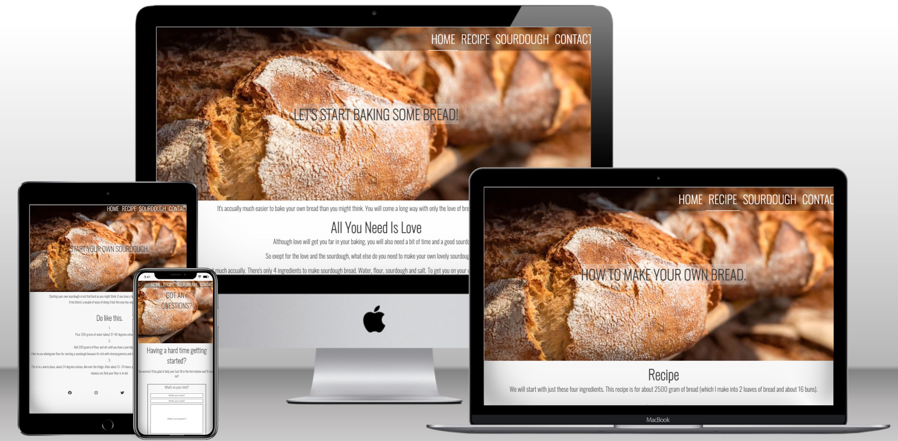
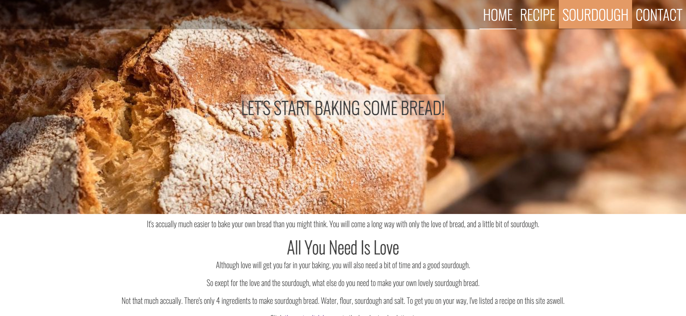

# Project 1 - Sourdough Bread - HTML & CSS Portfolio.

## Purpose & background

* The purpose of this first project is to show my understanding and competence regarding webdesign using the languages of HTML and CSS. 

* So for my first project I choosed to work with subject quite close to heart - bread or more exactly sourdough bread.
The site, in all its simplicity, is designed as a simple (maybe not bakingwise) "getting started"- site with sourdough baking. 

***

***

## The Site
[Sourdough bread](https://callee84.github.io/sourdough/index.html)

***

## Features and UX
I've choosen a website with simple features so the visitor easily can navigate throghtout the site. The purpose of the site is the content and therefore a pretty plain site.

Starting with the sticky navigation bar at the top that follows the visitor down through the page for quick and easy navigation through the website. The navigation bar also has a hover function which highlights the current position. This hover-function also appears on the contact form and in the footer on the social media links.

On the landing page I have added a zoom out effect on the center image. 

I've also added an iframe to the sourdough page with a video of how to make a sourdough starter.

On the contact site I've put in a contact form in case any visitor need some help. Clicking the submit-button takes the visitor to a confirmation page named "thanks.html".

The footer contians links to varius social media which opens in a new tab. 

***

## Site Structure
The site contains of five pages - index (loading page), recipe, sourdough, contact and a form response page called thanks.
Consistent thoughout the pages is the image in the header aswell as the sticky navigation bar, but with a different on-image-text on all pages.
As I described at the start the website has a very clean structure. As this is mainly a recipe-site it should be av very easy navigated site. 

### *The landing page - home page (index)*
Is designed as a simple welcome-page. Containing a quick welcome-text and an inspirational bread-picture. This picture also changes to a more mobilefriendly pic when sized down. There's also a link in the text to the reicpe page, aswell as in the sticky navigation bar.

### *Recipe*
The recipe side is a made up by a 9 step list that is numbered. Above that list is another unordered list containing the ingridients. 

### *Sourdough*
This side is also made up by a list in 3 steps and describes how to make a sourdough starter. I've also included a video via youtube in to an iframe. 

### *Contact*
Contact side consists of a form divided in to three text fields. All three text fields is required to fill in to be able hit the submit-button.

### *Thanks*
When the submit button is trigged on the contact page, it sends the visitor to a confirmation page containing a simple message that the form has been sent and an answer is to be expected. I've also added button that takes the visitor back to the home page.

***

## Testing
I've conducted 4 tests of the site. Two of the with focus on performance. 
The Lighthouse test using Goole Dev Tools scores the site with top grades exept for the performance with is in the low 90:s. The performance scores is draged down because of the big header image. 

However I've also tested the sites performance using GT-metrix and got the score of 100 and 94 for structure. I feel this is within the margin of error and keep the picture in this size.

I've also tested the site using the w3c html checker and jigsaw css tetser with no reported warnings.

#### *Loadingpage (index.html)*

#### *recipe.html*

#### *sourdough.html*

#### *contact.html*

#### *thanks.html*

#### *CSS*

***

## Deployment
This site was build using GitPod and deployd via GitHub. 

### Deploy to GitHub Pages
* This is done by going to the "settings" tab in the GitHub repository. (step 1 in picture below)
* After selecting settings you click the "page" tab on the left side of the page. (step 2 in picture below)
* Third step is to select the option "main" under the first dropdown with the default value of "none" and save. (step 3 i picture)
* After you hit the save button the page will refresh and show the url generated to your site. (step 4 i picture below)

***

## Credit

### Content
* Issues with css bugfixes were found searching [w3schools](https://www.w3schools.com/) and by revisit older lessons with the Code Institute Full Stack Deveploper program.
* Inspiration to hover function came from the [Love Running Essential Project](https://callee84.github.io/love-running/)
* Inspiration for Readme file came from [Code Institute Love Running repository](https://github.com/Code-Institute-Solutions/readme-template). 
* Inspiration for zoom out effect came from the [Love Running Essential Project](https://callee84.github.io/love-running/)

### Media
* Images used on site comes from the site [Pexels](https://www.pexels.com/) and is free to use.
* Video in iframe on sourdoogh page is linked to a youtube video.

### Special thanks
* To my mentor Harry Dhillon for exeptional help and guidance.

***

Carl Holm,
Kalmar, Sweden 
2022